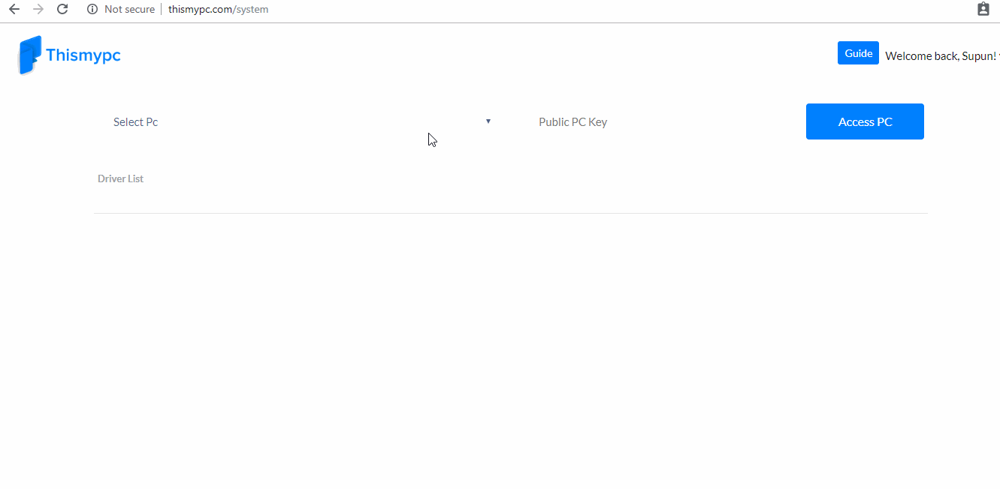
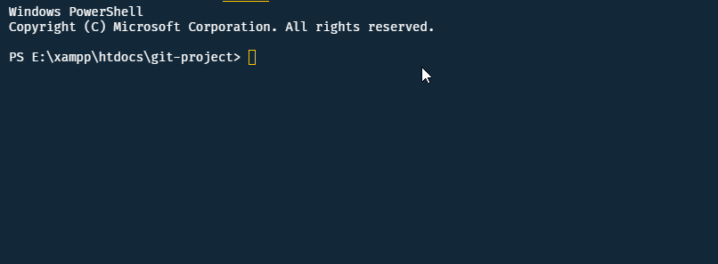
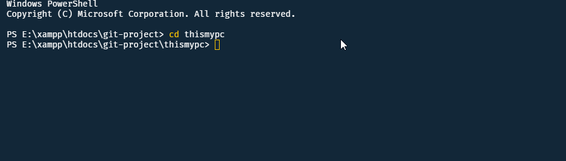

# This My PC

<div align="center">
    <a href="http://thismypc.com/">
        
    </a>
</div>

<br />

<div align="center">

[](http://thismypc.com/)
<br />
[](https://app.codacy.com/app/supunlakmal/thismypc?utm_source=github.com&utm_medium=referral&utm_content=supunlakmal/thismypc&utm_campaign=Badge_Grade_Dashboard)
 [](https://github.com/supunlakmal/thismypc/graphs/commit-activity) [](http://thismypc.com/) [](https://github.com/supunlakmal/thismypc/blob/master/LICENSE)
[](https://gitter.im/Thismypc/community)
</div>

ThisMyPC is a next-generation open source solution for remote pc. It's a full stack based project that starts as an experiment.

## Website - http://thismypc.com



## App Screenshots

Desktop App  Login         |  Desktop App Open | Web App  PC  Drivers       |  Web App PC Drivers Open
:-------------------------:|:-------------------------:|:-------------------------:|:-------------------------:
 || |

## Folder Structure

    .
    ├── .github/ISSUE_TEMPLATE
    ├── doc                          # All Api doc and gif files
    ├── thisMyPCApp                  # Electron JS app folder
    ├── thisMyPCMobileApp            # React Native Mobile App folder
    ├── thisMyPCServer               # Node JS MongoDB and Express JS server folder
    ├── thisMyPCWeb                  # Angular website folder
    ├── .gitignore
    ├── .gitlab-ci.yml
    ├── CODE_OF_CONDUCT.md
    ├── LICENSE
    └── README.md

## What (This my pc) ?

The concept behind thismypc app was transferred your computer folder and file information trough nodeJS server to web end as a json data.  

## Why (This my pc) ?

- The app's responsive web interface helps you to browse file in any resolution device
- You can use sours code for your own projects.
- It works well in low bandwidth environments.

## How to (Wiki) ?

All usage instruction and information update on [Github Wiki](https://github.com/supunlakmal/thismypc/wiki)

## Developing

### Platforms

Platform| Status
------------ | -------------
Microsoft Windows | Developing
Linux  | Pending
Mac os | Pending
Android  | Developing

#### Built With

- [Node JS](https://nodejs.org/en/)
- [Angular](https://angularjs.org/)
- [Electron JS](https://electronjs.org/)
- [Mongodb](https://www.mongodb.com/)
- [React Native](https://facebook.github.io/react-native/)

#### Clone Project

    ```shell
    git clone https://github.com/supunlakmal/thismypc.git
    ```


This Command  will copy a full  project  to your local  environment

## Angular Project

### Setting up Angular Project

    ```shell
    cd thisMyPCWeb
    npm i
    ```



`cd thisMyPCWeb` Move into angular Project Folder
`npm i` install all  dependency.

### Run Angular Project

Run `ng serve` for a dev server. Navigate to `http://localhost:4200/`. The app will automatically reload if you change any of the source files.

## Electron Project

### Setting up Electron Project

    ```shell
    cd thisMyPCApp
    npm i
    ```


`cd thisMyPCWeb` Move into  Electron  Project Folder
`npm i` install all  dependency.

### Run Electron  Project

Run `npm run start` start electron app in debug mode

## Node Server

### Setting up Node Server

    ```shell
    cd thisMyPCServer
    npm i
    ```

`cd thisMyPCServer` Move into  Node  Project Folder
`npm i` install all  dependency.

### Run Node  Project

Run `npm node index.js` to start node server

## REST  API

### API Reference

- PC - Personal Computer
- thismypc.com:5000 - This is Thismypc web site API url. You can use your own localhost erver link instead default Link.
- ":userID" -  User ID
- ":computerKey" - Computer Key

### Web API

Web API| URL | Description
------------ | ------------- | -------------
User Register| /api/v1/user/register | -
User Login | /api/v1/user/login | -
User Logout | /api/v1/user/:userID/logout | -
User Auth | /api/v1/user/authentication | -
User Info | /api/v1/user/:userID | -
User Online PC List| /api/v1/user/computer/online | -
Public PC Access | /api/v1/computer/public/access | -
User PC List | /api/v1/user/computer | -
Update User Account | /api/v1/user/update | -
Update User Password | /api/v1/user/password/edit | -
Update User PC Public status | /api/v1/user/computer/public/status/update | -
Update User PC Public Key | /api/v1/user/computer/public/key/update | -

### Web socket IO

Socket Name| Socket | Type | Description
------------ | ------------- |------------- | -------------
Join Socket from Web | joinFromWeb | emit | -
Folder or Driver  Open Request   | openFolder | emit | -
PC access  Requests  | pcAccessRequest | emit | -
Get Hard Drive List | hDDList | on | -
Folder or  hard drive open data   | openFolderRequestToWeb | on | -

### App API

APP API| URL | Description
------------ | ------------- | -------------
User Login From App | /api/v1/user/computer/login | -
User Info | /api/v1/user/:userID/computer/:computerKey | -
User Logout | /api/v1/user/:userID/computer/logout | -

### App socket IO

Socket Name| Socket | Type | Description
------------ | ------------- |------------- | -------------
Join Socket from APP | joinFromApp | emit | -
Send Hard Drive List   | hDDList | emit | -
Send Data inside Folder or  Hard Drive  | sendOpenFolderRequest | emit | -
Send callback  of Folder Create Function  | folderCreateCallback | emit | -
PC access user and data | pcAccessRequest | on | -
Folder or Hard drive  open request   | openFolderRequest | on | -
Folder Validation   | validateFolderName | on | -

## Database

MongoDB use as Database.

## Licensing

The MIT License 2019 Supun Lakmal
